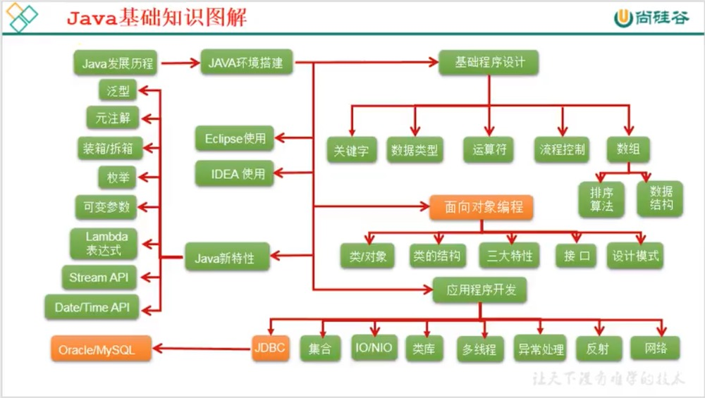
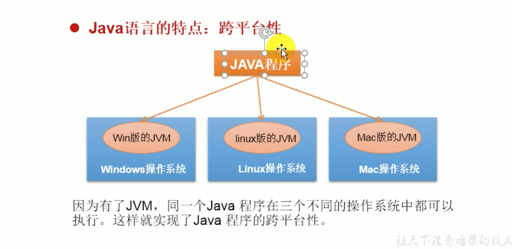

# 1. Java语言概述

Java基础图:

## 1.1 Java简史
* 2011年，JDK7.0
* 2014年，JDK8.0，继JDK5.0以来变化最大的版本
* 2017年，JDK9.0
* 2018年3月，JDK10.0，版本号18.3
* 2018年9月，JDK11.0，版本号18.9

## 1.2 Java技术体系平台
### Java SE(Java Standard Edition)标准版
支持桌面级应用的Java平台，提供了完整的Java核心API，此版本之前称为J2SE。

### Java EE(Java Enterprise Edition)企业版
是为开发企业环境下的应用程序提供的一套解决方案。该技术体系中包含的技术如Servlet、Jsp等，主要针对开发Web应用程序开发。版本之前称为J2EE。

### Java ME(Java Micro Edition)小型版
支持Java程序运行在移动终端(手机、PAD)上的平台，对Java API有所精简，并加入了针对移动端。此版本之前称为J2ME。

### Java Card
支持一些Java小程序(Applets)运行在小内存设备(如智能卡)上的平台。

## 1.3 Java语言特点
### 特点一: 面向对象
* 两个基本概念: 类、对象
* 三大特性: 封装、继承、多态

### 特点二: 健壮性
吸收了C、C++语言的优点，但去掉了其影响程序健壮性的部分(如指针、内存申请与释放等)，提供了一个相对安全的内存管理和访问机制。

### 特点三: 跨平台性
* 跨平台性: 通过Java语言编写的应用程序在不同的系统平台上都可以运行。
* 原理: 只要在需要运行Java应用程序的操作系统上，先安装一个Java虚拟机(JVM Java Virtual Machine)即可。由JVM来负责Java程序在该系统中的运行。

