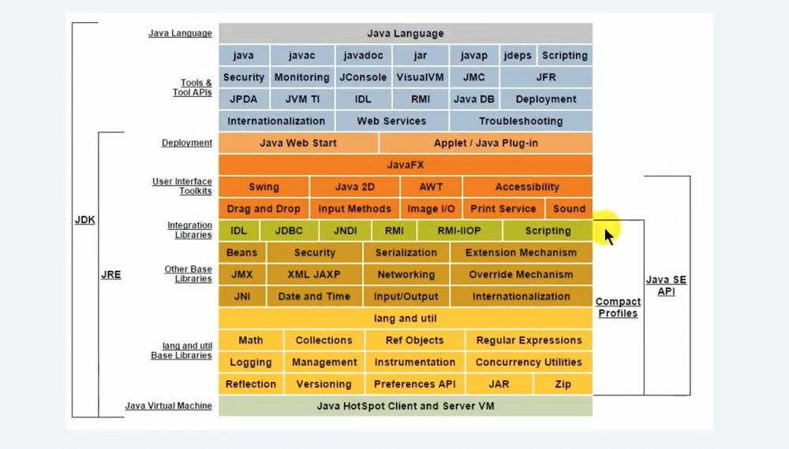

# 3. Java环境搭建

Java版本选择: JDK8.0

## 3.1 什么是JDK、JRE？

### JDK(Java Development Kit Java开发工具包)
JDK是提供给Java开发人员使用的，其中包含了Java的开发工具，也包括了JRE。所以安装了JDK，就不用再单独安装JRE了。

其中的开发工具:
* 编译工具(javac.exe)
* 打包工具(jar.ext)

### JRE(Java Runtime Environment Java运行环境)
包括Java虚拟机和Java程序所需的核心类库等，如果想要运行一个开发好的Java程序，计算机只需要安装JRE即可。

> 总结: 使用JDK的开发工具完成的Java程序，交给JRE去执行。

## 3.2 下载并安装JDK
### 官方网址
[www.oracle.com](www.oracle.com)
[java.sun.com](java.sun.com)

### 安装JDK & 配置环境

[JDK11安装及环境配置(Mac环境)](https://juejin.im/post/6877951505710710791/)

javac: 编译命令
java: 解释运行命令
javadoc: 生成一个以网页形式存在的文档命令

