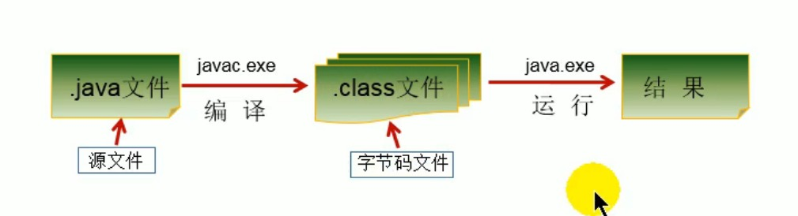

# 4. 开发体验HelloWorld

## 4.1 步骤
* 1.将Java代码编写到扩展名为.java的文件中
* 2.通过javac命令对该java文件进行编译
* 3.通过java命令对生成的class文件进行运行




## 4.2 HelloWorld程序

```java
class HelloWorld {
    public static void main(String[] args) {
        System.out.println("Hello World!");
    }
}
```
