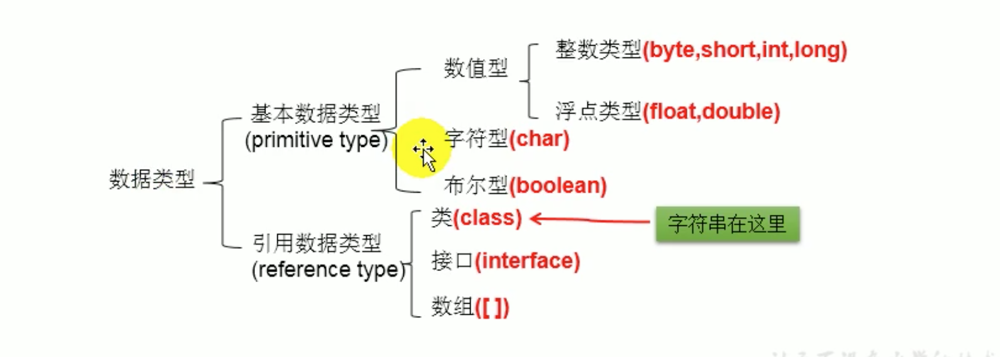
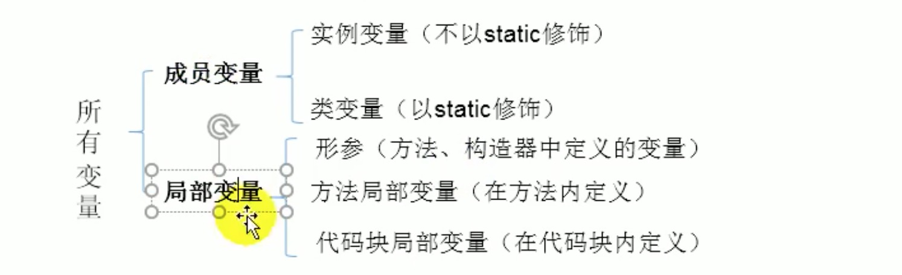

# 4. 变量的分类

## 4.1 变量的分类--按数据类型
对于每一种数据类型都定义了明确的具体数据类型(强类型语言)，在内存中分配了不同大小的内存空间。

* 基本数据类型
* 引用数据类型

### 基本数据类型
* 整型
    * byte
    * short
    * int
    * long
* 浮点型
    * float
    * double

### 引用数据类型
* 类(class)
* 接口(interface)
* 数组(array)

## 4.2 变量的分类--按声明的位置不同
* 成员变量
* 局部变量

### 成员变量
在方法体外，类体内声明的变量称为成员变量。

### 局部变量
在方法体内声明的变量称为局部变量。

`注意`: 二者在初始化值方面的异同，(同: 都有生命周期)(异: 局部变量除形参外，需显式初始化)。