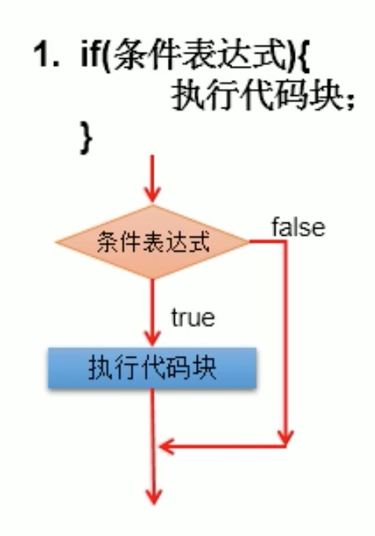
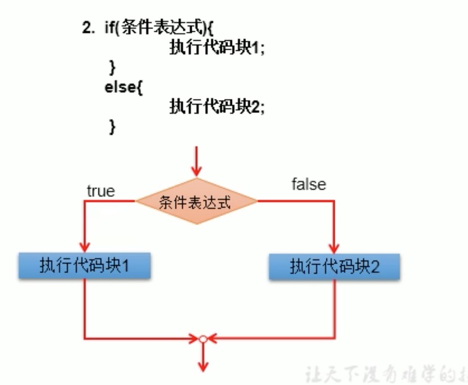
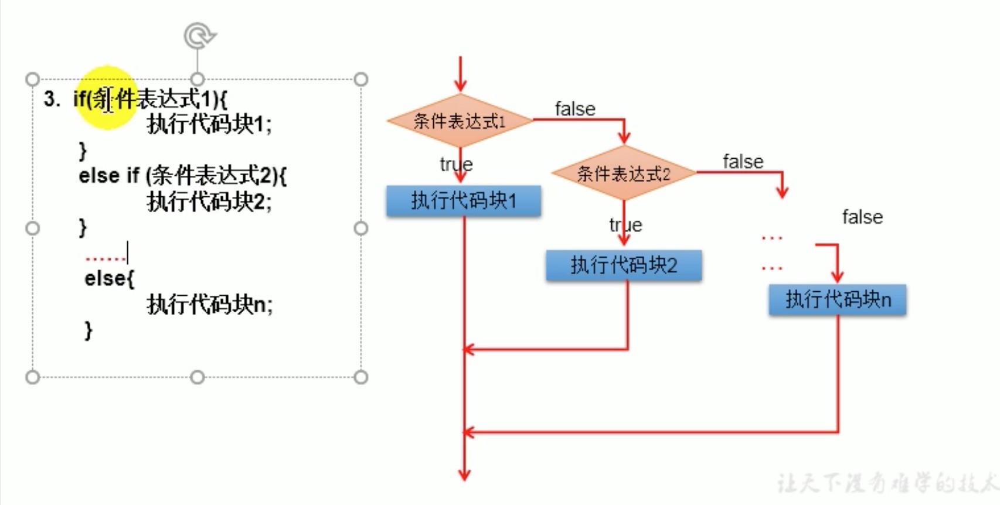

# 2. if-else

## 2.1 if-else格式
条件判断结构。


### 格式1: 单独if
```
if(条件表达式){
    执行代码块;
}
```




### 格式2: if-else
```
if(条件表达式){
    执行代码块1;
}
else{
    执行代码块2;
}
```



### 格式3: if-else if-else

```
if(条件表达式1){
    执行代码块1;
}
else if(条件表达式2){
    执行代码块2;
}
...
else{
    执行代码n;
}
```




## 2.2 if-else注意事项
* else结构是可选的
* 针对条件表达式: 
    * 如果多个条件表达式之间是"互斥"关系(没有交集关系)，哪个判断和执行语句声明在上面还是下面无所谓。
    * 如果多个条件表达式之间有"交集"关系，需要根据实际情况，考虑清楚应该将哪个结构声明在上面。
    * 如果多个条件表达式之间有"包含"关系，通常情况下，需要将范围小的声明在范围大的上面，否则，范围小的就没机会执行。
* if-else结构是可以相互嵌套的，但是最多不要超过3层
* 如果if-else结构的执行语句只有1行时，对应的一对{}是可以省略的，但是不建议省略
* 如果存在多个if但是只有一个else，else会采用就近原则，和else最近的一个if进行配对