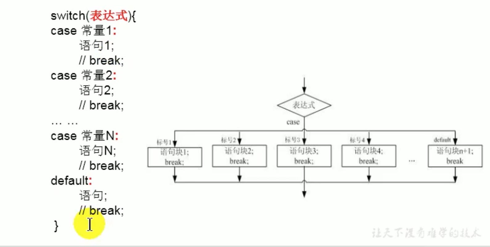

# 5. Switch-Case

## 5.1 Switch-Case结构

```
switch(表达式){
case 常量1:
    语句1;
    //break;
case 常量2:
    语句2;
    //break;
... ... 
case 常量N:
    语句N;
    //break;
default:
    语句;
    //break;
}
```




## 2.2 Switch-Case说明
* 根据switch表达式中的值，依次匹配各个case中的常量，一旦匹配成功，则进入相应case结构中，调用其执行语句。当调用完执行语句后，则仍然继续向下执行其他case中的执行语句，直到遇到break关键字或switch-case结构末尾结束为止。
* break可以使用在switch-case结构中，表示一旦执行到此关键字就跳出switch-case结构。
* switch结构中的表达式，只能是如下的6种数据结构之一:
    * byte
    * short
    * char
    * int
    * Enum(JDK5.0+新增的)
    * String(JDK7.0+新增的)
* case后只能声明常量，不能声明范围。
* break关键字是可选的，要根据实际的switch-case使用情况。
* default相当于if-else结构中else，default结构是可选的，位置是灵活的。
* 多个相同输出语句的case，可以合并。
```
case 常量1:
case 常量2:
case 常量3:
    语句;
```


