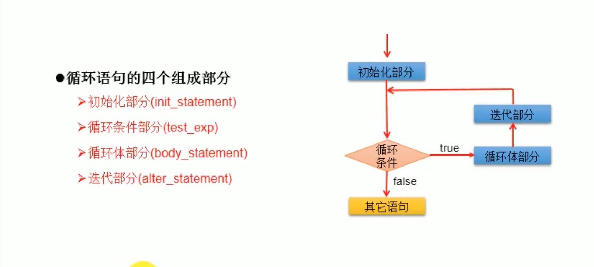

# 8. 循环结构

## 8.1 循环结构概念
在某些条件满足的情况下，反复执行特定代码的功能。

## 8.2 循环结构分类
* for循环
* while循环
* do-while循环

## 8.3 循环结构组成
循环结构由4个部分组成:
* 初始化部分(init_statement)
* 循环条件部分(test_exp)
* 循环体部分(body_statement)
* 迭代部分(alter_statement)

